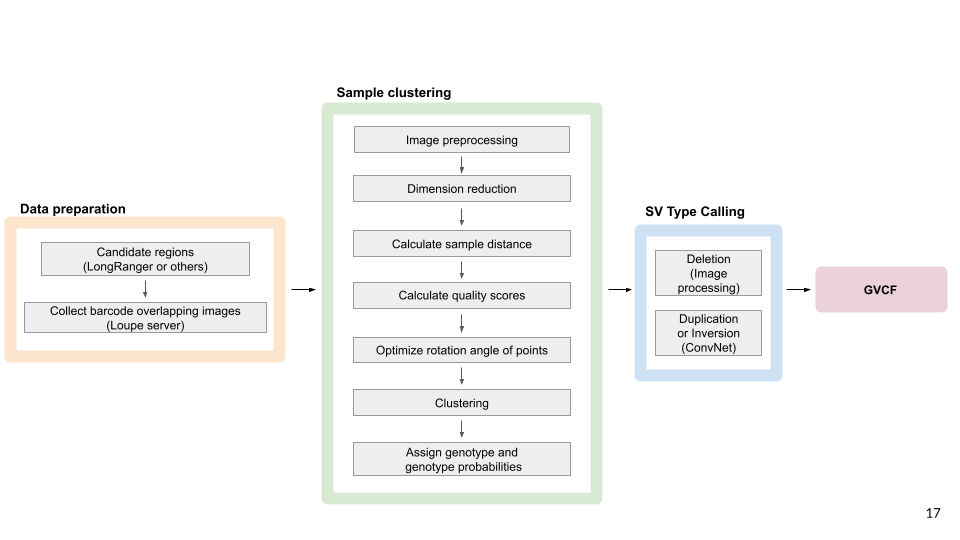

# SVJAM: structural variant joint analysis by machine learning

SVJAM jointly detects and genotypes large structural variants (SVs) from linked-read whole genome sequence data. 

## Flowchart



## Installation 
SVJAM was developed on python 3.8

Run the following command to clone the repository
```
git clone https://github.com/hakangunturkun/SVJAM
```

Then use the following command to install all the required libraries

```
cd SVJAM
pip install -r requirements.txt 
```

You'll also need a copy of the reference genome that matches your LongRanger analysis and place that in the **RefGenome** folder (file needs to be unzipped, with the extension name *.fa*)


## Analyzing the example data set on chr1

We provide an example image set for testing in **chr1/images/** folder. Image files are organized in folders named as: *chr1_93011035-93221780_chr1_93011035-93221780* The output will be located in the **chr1/output/** folder. 

You need to download the [mouse reference genome from UCSC](https://hgdownload.soe.ucsc.edu/goldenPath/mm10/bigZips/mm10.fa.gz), uncompress it, and put it in the **RefGenome** folder.

To do a test run using this data set, run the following command from the SVJAM installation directory 

```
python SVJAM chr1
```

## Obtaining your own images for analysis 
* Install the [loupe browser from 10X Genomics](https://www.10xgenomics.com/products/loupe-browser).
* Generate *.loupe files from linked-read WGS by using [longranger](https://support.10xgenomics.com/genome-exome/software/pipelines/latest/what-is-long-ranger).
* Open and organize **image_download/open_loupe.sh** then run it.
* Download images manually or use **image_download/chrome_multi_save_matrixView_pngs.py** for automatically download that uses Selenium library.

## Citation:

Gunturkun, M.H., Villani, F., Colonna, V., Ashbrook, D., Williams, R.W. and Chen, H. (2021). SVJAM:  Joint analysis of structural variants usinglinked read sequencing data. bioRxiv. [doi:10.1101/2021.11.02.467006](https://www.biorxiv.org/content/10.1101/2021.11.02.467006v1)
